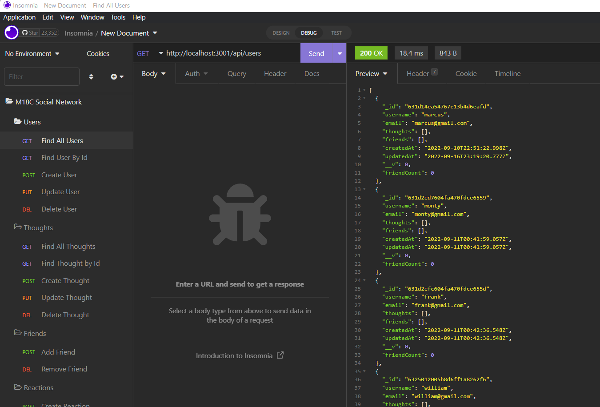

# Social Network API

## Application Description
This is a social network web application where users can share their thoughts, react to friends’ thoughts, and add or delete friends. Express.js is used for routing, as well as a MongoDB database, and the Mongoose ODM. 

## Challenge Description
The application is started running "npm start" in the terminal. Upon opening Insomnia, routes can be acccessed at localhost port 3001. The user routes for functionality include GET to find all users or a specific uesr, POST to create a user, PUT to update one and finally DELETE. The thought routes similarly include GET to find all or a single thought, POST to create a thought, PUT to update, or DELETE. Next, user routes enable POST to create a friend or DELETE. Thought routes additionally include POST to add a reaction or DELETE.

## User Story

```
AS A social media startup
I WANT an API for my social network that uses a NoSQL database
SO THAT my website can handle large amounts of unstructured data
```

## Acceptance Criteria

```
GIVEN a social network API
WHEN I enter the command to invoke the application
THEN my server is started and the Mongoose models are synced to the MongoDB database
WHEN I open API GET routes in Insomnia for users and thoughts
THEN the data for each of these routes is displayed in a formatted JSON
WHEN I test API POST, PUT, and DELETE routes in Insomnia
THEN I am able to successfully create, update, and delete users and thoughts in my database
WHEN I test API POST and DELETE routes in Insomnia
THEN I am able to successfully create and delete reactions to thoughts and add and remove friends to a user’s friend list
```

## Tasks Completed
* API routes for users/thoughts/reactions/friends
* contollers with function to enable creating/deleting/updating
* models for schemas of users/thoughts/reactions
* express, mongoose, nodeman node dependencies
* comments

## Languages
- JavaScript

## Links
* [Application Walkthrough Video]

Part 1

(https://youtu.be/SAfwCnJCVzI)

Part 2

(https://youtu.be/kUw35xLp5hM)

Part 3

(https://youtu.be/0ZvOWG95IjA)

* [Repository](https://github.com/villettec/M18C-Social_Network_API)

## Screenshots


## Credit
Villette Comfort

villette@live.com